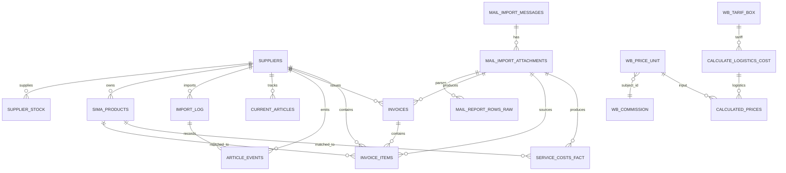

# Карта базы данных PostgreSQL

Источник: `database/schema.sql`, выгруженный PostgreSQL 18.4 командой `pg_dump --schema-only`.

## Сводка

| Тип объекта | Количество |
|---|---:|
| Пользовательские схемы | 2 (`public`, `sima_land`) |
| Служебные схемы | 1 (`pgagent`) |
| Таблицы приложения | 20 |
| Представления | 1 |
| Пользовательские функции | 1 |
| Расширения | 1 (`pgagent`) |

> Схема `promportal` в текущем дампе отсутствует. Если она должна находиться в этой базе, необходимо проверить, существует ли она в базе `postgres` на сервере и доступна ли пользователю `petr`.

---

# 1. Схема `public`

Основная схема Wildberries, поставщиков, цен и служебных данных ZennoPoster.

## Таблицы

### `public.suppliers`
Справочник поставщиков.

- PK: `supplier_id`
- UNIQUE: `supplier_code`
- Основные поля: `supplier_code`, `supplier_name`, `is_active`, `comment`
- Центральная родительская таблица для данных поставщиков в других схемах.

### `public.supplier_stock`
Актуальные остатки и цены поставщиков для передачи в WB.

- PK: `vendor_code`
- FK: `supplier_id → public.suppliers.supplier_id`
- Основные поля: `stock`, `price`, `stock_timestamp`, `shipping_date`
- Важное замечание: первичный ключ только по `vendor_code`. Одинаковый артикул у двух поставщиков сейчас хранить нельзя без изменения ключа.

### `public.wb_cards`
Карточки товаров Wildberries.

- PK: `nmid`
- Основные поля: `vendorcode`, `subjectid`, `brand`, `title`, `description`
- JSONB: `photos`, `dimensions`, `characteristics`, `sizes`, `tags`
- Поле `needkiz` показывает необходимость КИЗ/маркировки.

### `public.wb_price_unit`
Центральная таблица параметров расчета цены WB.

- PK: `nmid`
- Содержит закупочную цену, категорию, размеры, комиссии, налог, процент выкупа, желаемую маржу и текущие цены WB.
- Используется представлением `public.calculated_prices`.

### `public.wb_commission`
Комиссии WB по предметам и моделям продаж.

- PK: `id`
- Для FBS используется `kgvp_marketplace`.
- Логическая связь с `wb_price_unit.subject_id` выполняется через JOIN, но внешний ключ отсутствует.

### `public.wb_tarif_box`
Тарифы коробочной логистики WB.

- PK: `id`
- UNIQUE: `warehouse_name`
- Используется функцией `public.calculate_logistics_cost(jsonb)`.

### `public.product_prices`
История цен и остатков поставщика.

- PK: `id`
- Основные поля: `vendor_code`, `price`, `timestamp`, `stock`, `stock_timestamp`
- В дампе комментарий указывает сбор раз в день.

### `public.proxy`
Учет прокси по сайту и стране.

- Поля: `login`, `country`, `site`
- Первичный ключ отсутствует.

### `public.zennodata`
Временные или служебные данные ZennoPoster.

- PK: `id`
- Поля: `type`, `data`, `created_at`, `expires_at`

## Представления

### `public.calculated_prices`
Расчет безопасной цены продажи WB.

Зависимости:

- `public.wb_price_unit`
- `public.wb_commission`
- `public.calculate_logistics_cost(jsonb)`
- косвенно `public.wb_tarif_box`

Основной результат:

- закупочная цена и затраты;
- сырая и скорректированная логистика;
- комиссия WB;
- цена безубыточности;
- безопасная расчетная цена;
- отклонение от текущей цены;
- статус цены;
- цена для отправки;
- расчетная прибыль в рублях.

## Функции

### `public.calculate_logistics_cost(p_dimensions jsonb)`
Рассчитывает логистику FBS для склада `Белая дача`.

Алгоритм:

1. Берет базовый тариф и тариф дополнительного литра из `public.wb_tarif_box`.
2. Читает `length`, `width`, `height` из JSONB.
3. Рассчитывает объем в литрах.
4. Для объема свыше 1 литра добавляет стоимость дополнительных литров.
5. При отсутствии тарифа или корректных размеров возвращает `999.00`.

---

# 2. Схема `sima_land`

Импорт каталога Сима-ленд, контроль появления товаров, загрузка писем и счетов, учет расходов.

## Каталог и импорт CSV

### `sima_land.sima_staging`
Временная таблица для загрузки исходного CSV.

- Все основные значения хранятся как текст.
- Первичный ключ отсутствует.
- Используется как промежуточный слой перед `sima_products`.

### `sima_land.sima_products`
Актуальный каталог товаров Сима-ленд.

- PK: `id`
- FK: `supplier_id → public.suppliers.supplier_id`
- Основные данные: артикул, название, категории, бренд, размеры, вес, фотографии, маркировка, цены и остаток.
- Важные флаги: `is_in_wb`, `is_in_brendwall_import`.
- UNIQUE по `(supplier_id, article)` отсутствует.

### `sima_land.import_log`
Журнал загрузок CSV.

- PK: `id`
- FK: `supplier_id → public.suppliers.supplier_id`
- Фиксирует источник, путь, статус, количество строк, размер файла и ошибку.

### `sima_land.current_articles`
Текущее состояние артикулов поставщика.

- PK: `id`
- UNIQUE: `(supplier_id, article)`
- FK: `supplier_id → public.suppliers.supplier_id`
- Хранит активность, первое и последнее появление, а также первые зафиксированные цены.

### `sima_land.article_events`
История появления и исчезновения артикулов.

- PK: `id`
- FK: `supplier_id → public.suppliers.supplier_id`
- FK: `import_log_id → sima_land.import_log.id`
- CHECK: `event_type IN ('appeared', 'disappeared')`

## Gmail и вложения

### `sima_land.mail_import_messages`
Журнал писем Gmail.

- PK: `id`
- UNIQUE INDEX: `gmail_message_id`
- Содержит отправителя, тему, дату, число вложений, статус и ошибки.
- Поле `supplier_id` не имеет внешнего ключа в текущем дампе.

### `sima_land.mail_import_attachments`
Файлы-вложения писем.

- PK: `id`
- FK: `message_id → mail_import_messages.id`
- Хранит имя, расширение, хэш, локальный путь, статусы скачивания и парсинга.

### `sima_land.mail_report_rows_raw`
Сырые строки разобранных файлов.

- PK: `id`
- FK: `attachment_id → mail_import_attachments.id`
- Исходные значения количества и цен сохраняются текстом.
- Поле `supplier_id` не имеет внешнего ключа в текущем дампе.

## Счета

### `sima_land.invoices`
Заголовки счетов Сима-ленд.

- PK: `id`
- UNIQUE: `(supplier_id, invoice_number)`
- FK: `attachment_id → mail_import_attachments.id`
- FK: `supplier_id → public.suppliers.supplier_id`
- `truestat_sync_date` фиксирует успешную отправку счета в TrueStat.

### `sima_land.invoice_items`
Товарные строки счетов.

- PK: `id`
- FK: `invoice_id → invoices.id`
- FK: `attachment_id → mail_import_attachments.id`
- FK: `supplier_id → public.suppliers.supplier_id`
- FK: `matched_product_id → sima_products.id`
- Содержит количество, цены до и после скидки, итог, объем, доставку и статус сопоставления.

## Расходы

### `sima_land.service_costs_fact`
Фактические расходы по услугам.

- PK: `id`
- FK: `attachment_id → mail_import_attachments.id`
- FK: `matched_product_id → sima_products.id`
- Поле `supplier_id` не имеет внешнего ключа в текущем дампе.
- Содержит период, вид услуги, количество, стоимость единицы и итоговую стоимость.

---

# 3. Основные связи



---

# 4. Важные архитектурные замечания

1. `supplier_stock` рассчитана на уникальный `vendor_code` во всей базе. Для двух поставщиков безопаснее будет перейти на составной ключ `(supplier_id, vendor_code)` или отдельный внутренний ID.
2. В `sima_products` нет ограничения уникальности `(supplier_id, article)`. Это допускает дубли внутри актуального каталога.
3. `mail_import_messages.supplier_id`, `mail_report_rows_raw.supplier_id` и `service_costs_fact.supplier_id` не защищены внешними ключами.
4. `wb_price_unit.subject_id → wb_commission.subject_id` является логической связью без FK. В `wb_commission.subject_id` также нет UNIQUE.
5. `invoice_items` одновременно хранит `invoice_id`, `attachment_id` и `supplier_id`. База не проверяет, что все три значения относятся к одной цепочке данных.
6. Связи счетов и расходов с `sima_products.id` зависят от стабильности ID. Если `sima_products` полностью пересоздается при ежедневном импорте, такие связи могут стать недействительными или блокировать очистку таблицы.
7. В дампе отсутствуют схема `promportal`, таблица статистики WB и другие объекты, известные по предыдущей архитектуре. Это означает, что текущий дамп описывает не всю ранее обсуждавшуюся инфраструктуру либо часть объектов находится в другой базе.

---

# 5. Потоки данных

## Каталог поставщика

```text
CSV Сима-ленд
    → sima_staging
    → sima_products
    → current_articles
    → article_events
```

## Письма и счета

```text
Gmail
    → mail_import_messages
    → mail_import_attachments
    → invoices
    → invoice_items
    → TrueStat
```

## Расчет цены WB

```text
wb_cards / данные поставщика
    → wb_price_unit
    + wb_commission
    + wb_tarif_box
    → calculate_logistics_cost()
    → calculated_prices
    → отправка цены через WB API
```

## Остатки FBS

```text
Поставщик
    → supplier_stock
    → ZennoPoster / интеграционный сервис
    → WB API
```

---

# 6. Объекты, необходимые для будущего FBS-модуля

Существующая база уже содержит:

- справочник поставщиков;
- карточки WB;
- актуальные остатки поставщика;
- расчет цен и логистики;
- каталог и счета Сима-ленд.

Пока отсутствуют специализированные таблицы для:

- домашних складов;
- собственных остатков по складам;
- заказов WB FBS;
- заказов Ozon FBS;
- резервов товара;
- движений товара;
- заданий на сборку;
- статусов печати этикеток;
- уведомлений;
- истории отправки остатков на маркетплейсы.

Эти объекты следует создавать отдельными миграциями, не меняя существующие производственные таблицы без необходимости.
